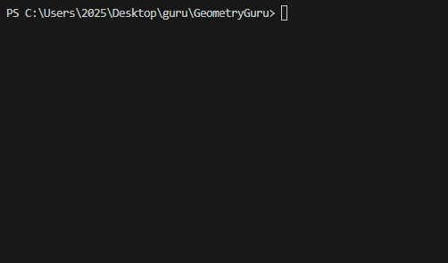

# GeometryGuru 📐

An interactive console-based geometry calculator built with C#. Calculate areas of shapes and validate triangle properties with a clean, user-friendly interface.

## Overview

GeometryGuru provides quick calculations for:
- **Triangle area** (using base and height)
- **Rectangle area** (length × width)  
- **Circle area** (πr²)
- **Triangle validation** (checks if sides can form a valid triangle)

## 🚀 Features

- ✅ **Easy-to-use menu system**
- ✅ **Input validation** (prevents invalid entries)
- ✅ **Clean C# OOP structure**
- ✅ **Educational tool** for geometry basics

## 📸 Demonstration

](Gif.gif)